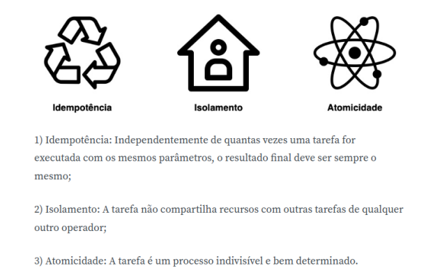
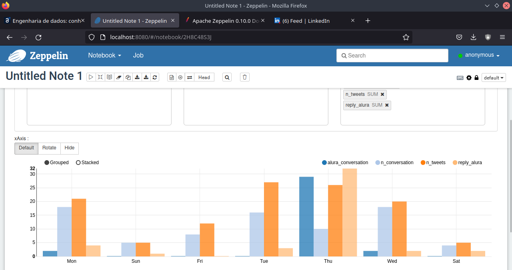
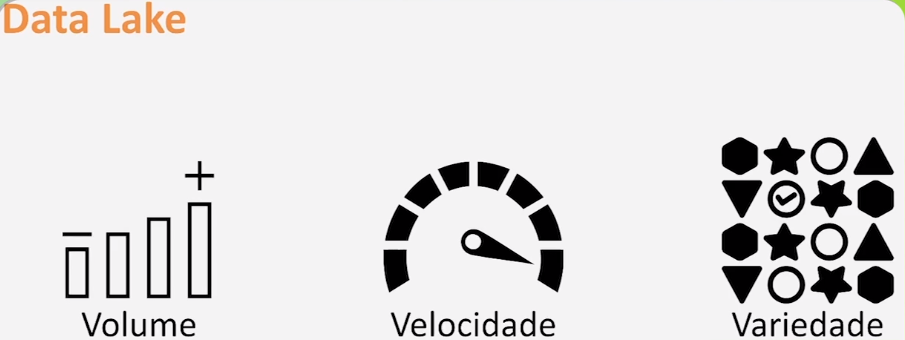

## Engenharia de dados: conhecendo Apache Airflow

Objetivo: extrair dados diretamente da API do Twitter

Fizemos a construção do data pipeline! Começamos com requisitos do projeto, em que deveríamos providenciar dados para o time de marketing e cientistas de dados referentes a dados do Twitter relacionados ao perfil da Alura Online. As ferramentas Apache que foram introduzidas neste curso, [Airflow]("https://airflow.apache.org/") e [Spark]("https://spark.apache.org/"), são utilizadas na maioria das empresas ao redor do mundo.

Características do Airflow:
<p align="center">
  

A arquitetura em medalhas, do inglês medallion, permite acesso flexível e processamento de dados extensíveis. As tabelas na camada bronze são usadas para ingestão de dados e permitem acesso rápido, sem a necessidade de modelagem a uma única fonte de dados. Conforme os dados fluem para as tabelas na camada Silver, ou prata, eles se tornam mais refinados e otimizados para a inteligência de negócio, ou BI, e ciência de dados, através de transformações.

As camadas Bronze e Silver agem como um ODS, ou seja, um banco de dados operacional, cujas tabelas permitem modificações ágeis para serem reproduzidas nas tabelas transformadas. Para análises profundas, se utiliza a camada Gold, ou ouro, e o usuário possui o poder de extrair conhecimento e formular pesquisas.
  
Dados na camada Gold:
  <p align="center">
  

Pensando no data lake como um lago que purifica a água para ser consumida por analistas em suas pesquisas de BI e cientistas de dados em seus algoritmos de Machine Learning, as tabelas na etapa Bronze recebem água constantemente e em grande quantidade, e então fica “suja”, com diferentes procedências. Esta água flui constantemente para a etapa Silver, juntando com águas que vieram de diferentes locais e começando a ser purificada, até que, como em um rio de águas cristalinas, é encontrada na camada Gold pronta para consumo.
    
Três Vs:
    <p  aliggn="center">
      


Entrando na pasta do projeto e inciando a máquina virtual
```bash
$ cd datapipeline
$ source .env/bin/activate
```
Colocando as variáveis de ambiente
```bash
$ export AIRFLOW_HOME=$(pwd)/airflow
$ export BEARER_TOKEN=XYZ

Comandos de inicialização:
```bash
$ airflow initdb
$ airflow scheduler
